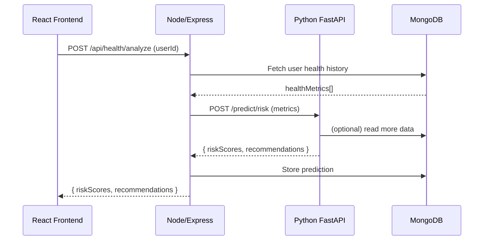

# PreventAI — Full Project Plan

> **Team:** 3 MERN Developers + 1 AI/ML Developer  
> **Tools:** Cursor IDE + Claude 4.6  
> **Stack:** React · Node/Express · MongoDB · Python (FastAPI) · TensorFlow/Scikit-learn

---

## 1. System Architecture

```mermaid
graph TB
    subgraph "Frontend — React"
        A[Landing / Auth Pages]
        B[Dashboard - Male/Female]
        C[Glass Body Digital Twin]
        D[Exposome Radar]
        E[Wearable Panel UI]
        F[Grocery Scanner]
        G[Goal Planner / What-If]
        H[Age Comparison Chart]
        I[Emergency Action UI]
        J[Doctor Booking]
    end

    subgraph "Backend — Node/Express"
        K[Auth & Profile API]
        L[Health Data API]
        M[Appointment API]
        N[Notification Service]
        O[Calendar/Weather/AQI Proxy]
    end

    subgraph "AI Microservice — Python FastAPI"
        P[Risk Prediction Engine]
        Q[Recommendation Engine]
        R[Glycemic Curve Model]
        S[Sleep Debt Calculator]
        T[Dopamine/Screen Time Model]
        U[Exposome Analysis]
        V[Baseline Improvement Model]
    end

    subgraph "Database — MongoDB"
        W[(Users Collection)]
        X[(Health Metrics Collection)]
        Y[(Predictions Collection)]
        Z[(Appointments Collection)]
    end

    A & B & C & D & E & F & G & H & I & J -->|REST API| K & L & M & N & O
    L -->|HTTP / Internal| P & Q & R & S & T & U & V
    K & L & M --> W & X & Y & Z
```



### Key Architecture Decision: How Python AI Joins MERN

> [!IMPORTANT]
> The AI/ML code runs as a **separate Python FastAPI microservice** on its own port (e.g., `localhost:8000`). The Node/Express backend calls it over HTTP. This solves the "Python in MERN" problem cleanly.

**Flow:**
```
React Frontend  →  Node/Express API (:5000)  →  Python FastAPI AI Service (:8000)
                         ↕                              ↕
                     MongoDB                     ML Models (local files)
```

- The **Node backend** is the single gateway for the frontend.
- When a request needs AI (predictions, recommendations), Node calls the Python service internally.
- The **Python service** reads/writes to the same MongoDB using `pymongo` or `motor`.
- Models are stored as `.pkl` / `.h5` files and loaded on startup.

---

## 2. Database Schema (Shared Single MongoDB)

> [!TIP]
> Since everyone shares one MongoDB, define the schema together on **Day 1** to avoid conflicts.

| Collection | Key Fields | Written By |
|---|---|---|
| `users` | name, email, password, gender, dob, emergencyContacts, linkedProfiles, insuranceId | MERN Dev 1 |
| `healthMetrics` | userId, date, steps, sleep, heartRate, bloodPressure, weight, calories, screenTime, waterIntake, stressLevel | MERN Dev 2 |
| `predictions` | userId, date, riskScores{}, recommendations[], baselineComparison, healthCredits | AI Dev |
| `appointments` | userId, doctorId, date, status, notes | MERN Dev 3 |
| `groceryScans` | userId, date, items[], nutritionAnalysis, recommendations[] | MERN Dev 3 + AI |
| `exposomeData` | userId, date, aqi, weather, uvIndex, pathogenRisk, suggestions[] | MERN Dev 2 + AI |
| `medicalReports` | userId, organ/system, testName, date, values, nextTestDue | MERN Dev 1 |

---

## 3. Feature Assignment & Team Division

### 👤 MERN Dev 1 — "Profile & Digital Twin"
**Owns:** User system + Glass Body feature

| Feature | Details |
|---|---|
| Auth & Profile | Signup/Login (JWT), profile linking (family members), gender-based dashboard routing |
| Glass Body (Digital Twin) | Interactive 3D/SVG human body with toggleable layers (skeleton, organs, muscles, nervous, skin). Click on any organ/bone → show stats from `medicalReports`. Remind for periodic tests (e.g., thyroid). Show risks. |
| Medical Reports CRUD | Upload/enter test results, attach to specific organs. Track test schedules. |
| Emergency Action UI | Detect emergency state → loud audio alert, auto-call 911, message emergency contacts, display instructions (e.g., "chew aspirin"). Works on phone + wearable panel. |

**Tech notes:**
- Glass Body: Use **Three.js** (3D) or **SVG layers with React** (lighter). Each body system = separate SVG layer with `opacity` toggle.
- Emergency: Use `Web Audio API` for alarm, `navigator.vibrate()`, and a backend endpoint the wearable hits.

---

### 👤 MERN Dev 2 — "Health Tracking & Exposome"
**Owns:** Real-time health data + Exposome Radar

| Feature | Details |
|---|---|
| Health Dashboard | Gender-specific dashboards. Charts for steps, sleep, heart rate, calories, water. Daily/weekly/monthly views using **Recharts** or **Chart.js**. |
| Step Counter & Sleep Tracker | Manual input + simulated wearable data. sleep debt calculation (UI only, formula from AI). |
| Screen Time & Dopamine Calculator | Input screen time → visualize dopamine impact using AI formula. |
| Glycemic Curve | Input meals → display glycemic response curve (data from AI service). |
| Exposome Radar | Connect to: **OpenWeatherMap API** (weather/UV), **AQICN API** (air quality), **Google Calendar API** (schedule). Display dashboard: AQI, pathogen risk, UV index, weather. Smart suggestions: "wear mask," "apply sunscreen," "10-min gap + cloudy = go for walk." |
| Wearable Panel UI | A separate responsive panel view mimicking a smartwatch UI. Shows: heart rate, steps, alerts, emergency button. |

**Tech notes:**
- Exposome: Node backend proxies external APIs (weather, AQI) to avoid CORS + add caching.
- Wearable Panel: A separate route `/wearable` with a circular/small-screen CSS layout.

---

### 👤 MERN Dev 3 — "Actions & Engagement"
**Owns:** Appointments + Grocery + Goals + Rewards

| Feature | Details |
|---|---|
| Book Doctor Appointment | Search doctors (mock data), pick time slot, confirm, view history. Calendar integration. |
| Grocery Scanner | Camera/upload barcode or receipt image → send to AI for nutrition analysis → show per-item recommendations ("reduce sugar," "add fiber"). Use **Tesseract.js** or send image to Python for OCR. |
| Goal Planner ("What If") | User sets a health goal (e.g., "lose 5 kg in 3 months") → AI returns a plan with weekly milestones. Interactive "what if" simulator. |
| Actual Age Chart | Visual comparison: chronological age vs. biological age (calculated by AI). Animated bar/gauge chart. |
| Health Credit System | Display earned credits, history, redeemable rewards (insurance discount, free screening, etc.). Leaderboard (optional). |
| Lock Screen Widget | After deployment: a PWA widget concept. Show a mini dashboard card (steps, next appointment, risk alert). Use **PWA + Web App Manifest**. |
| Landing Page & Navigation | The main homepage that ties all features together. Responsive nav, feature showcase, onboarding flow. |

---

### 🤖 AI/ML Dev — "Prediction & Intelligence Engine"
**Owns:** Python FastAPI microservice with all AI endpoints

| Endpoint | Input | Output |
|---|---|---|
| `POST /predict/risk` | userId, healthMetrics history | riskScores: { diabetes: 0.7, cardiac: 0.3, ... }, top risks, trend |
| `POST /recommend` | userId, riskScores, current metrics | personalized recommendations[] |
| `POST /baseline-compare` | userId, previous baseline, current metrics | improvement %, adaptive goals, health credits earned |
| `POST /glycemic-curve` | meal items[], user profile | glycemic response curve data points |
| `POST /sleep-debt` | sleep history[] | total debt, recovery plan |
| `POST /dopamine-score` | screen time data | dopamine impact score, suggestions |
| `POST /age-biological` | healthMetrics, lifestyle data | biological age estimate, comparison |
| `POST /grocery-analyze` | image or item list | per-item nutrition, recommendations |
| `POST /exposome-risk` | aqi, weather, user health profile | personalized risk, preventive actions |
| `POST /goal-plan` | goal description, current metrics | weekly milestone plan |
| `POST /emergency-detect` | realtime vitals | emergency: true/false, type, action |

**Tech stack for AI Dev:**
- **FastAPI** for the API server
- **Scikit-learn** for risk prediction (Random Forest / XGBoost on lifestyle features)
- **Pre-trained models** or simple heuristic formulas for MVP (glycemic, sleep debt, dopamine)
- **MongoDB** access via `pymongo` for reading user data
- **Tesseract / EasyOCR** for grocery receipt parsing

> [!NOTE]
> For the hackathon/prototype, many "AI" features can start as **rule-based engines** with realistic formulas. Real ML models can replace them later. The API contract stays the same.

---

## 4. Integration Strategy

### Step-by-Step Integration



### Solving the "How does Python join MERN" Problem

| Concern | Solution |
|---|---|
| Different languages | Python runs as a **separate service**. Communication via REST APIs. |
| Shared database | All services connect to the **same MongoDB Atlas** instance. |
| Running locally | Use `concurrently` or a simple `docker-compose` to start all 3 services. |
| Deployment | Deploy Node and Python as separate services on **Railway / Render / Fly.io**. |
| API contract | Define all endpoints in a shared **API spec document** on Day 1. |

### Local Dev Setup

```bash
# Terminal 1 — Frontend
cd client && npm run dev          # port 3000

# Terminal 2 — Backend
cd server && npm run dev          # port 5000

# Terminal 3 — AI Service
cd ai-service && uvicorn main:app --reload   # port 8000
```

---

## 5. Folder Structure

```
preventai/
├── client/                    # React (Vite)
│   ├── src/
│   │   ├── components/
│   │   │   ├── GlassBody/     # Dev 1
│   │   │   ├── Dashboard/     # Dev 2
│   │   │   ├── Exposome/      # Dev 2
│   │   │   ├── Wearable/      # Dev 2
│   │   │   ├── Appointments/  # Dev 3
│   │   │   ├── Grocery/       # Dev 3
│   │   │   ├── GoalPlanner/   # Dev 3
│   │   │   ├── Emergency/     # Dev 1
│   │   │   └── Shared/        # All
│   │   ├── pages/
│   │   ├── hooks/
│   │   ├── services/          # API call functions
│   │   └── App.jsx
│   └── package.json
│
├── server/                    # Node/Express
│   ├── routes/
│   ├── controllers/
│   ├── models/                # Mongoose schemas
│   ├── middleware/
│   ├── services/              # AI service caller
│   └── server.js
│
├── ai-service/                # Python FastAPI
│   ├── main.py
│   ├── routers/
│   ├── models/                # ML model files
│   ├── services/
│   ├── utils/
│   └── requirements.txt
│
└── docker-compose.yml         # (optional) for easy startup
```

---

## 6. Sprint Plan (4 Weeks)

### Week 1 — Foundation
| Person | Tasks |
|---|---|
| **Dev 1** | Auth system (JWT), user model, profile linking, MongoDB setup on Atlas |
| **Dev 2** | Health metrics model & API, dashboard layout (gender-based), chart components |
| **Dev 3** | Landing page, navigation, appointment model & booking UI |
| **AI Dev** | FastAPI boilerplate, `/predict/risk` endpoint with rule-based model, `/recommend` endpoint, MongoDB connection |

> **Day 1 mandatory sync:** Finalize MongoDB schema + API contracts together.

### Week 2 — Core Features
| Person | Tasks |
|---|---|
| **Dev 1** | Glass Body SVG layers, organ click → stats view, medical reports CRUD |
| **Dev 2** | Step counter, sleep tracker, sleep debt UI, exposome radar (API integrations) |
| **Dev 3** | Grocery scanner (camera + OCR), goal planner UI, age chart visualization |
| **AI Dev** | `/glycemic-curve`, `/sleep-debt`, `/dopamine-score`, `/grocery-analyze`, `/age-biological` endpoints |

### Week 3 — Advanced Features + Integration
| Person | Tasks |
|---|---|
| **Dev 1** | Emergency action system (alarm, contacts, instructions), Glass Body ↔ AI integration |
| **Dev 2** | Wearable panel UI, glycemic curve visualization, screen time UI, Exposome ↔ AI integration |
| **Dev 3** | Health credit system, what-if simulator ↔ AI, Lock screen widget (PWA), integrate landing page with all modules |
| **AI Dev** | `/baseline-compare`, `/goal-plan`, `/exposome-risk`, `/emergency-detect`. Improve models with better heuristics. |

### Week 4 — Polish & Deploy
| Person | Tasks |
|---|---|
| **All** | Bug fixes, UI polish, responsiveness, animations |
| **Dev 1** | Glass Body animations, emergency flow E2E test |
| **Dev 2** | Dashboard polish, wearable panel refinement |
| **Dev 3** | Final landing page, navigation, PWA setup, deployment pipeline |
| **AI Dev** | Model accuracy improvements, API documentation, load testing |

---

## 7. Using Cursor + Claude Effectively

| Task | How to Use Claude |
|---|---|
| **Boilerplate generation** | "Generate a FastAPI router with endpoints for risk prediction, glycemic curve, and sleep debt" |
| **React component scaffolding** | "Create an interactive SVG body component with toggleable layers for skeleton, organs, muscles" |
| **API integration code** | "Write a Node service that calls Python FastAPI at localhost:8000/predict/risk and handles errors" |
| **Chart components** | "Create a Recharts component showing biological age vs actual age as an animated gauge" |
| **Schema design** | "Generate Mongoose schemas for users, healthMetrics, predictions, and appointments" |
| **Debugging integration** | Paste both Node and Python code and ask Claude to debug the data flow |

> [!TIP]
> Each dev should work in their **own component folders** to avoid merge conflicts. Use a shared `services/api.js` file with clear function names like `fetchRiskPrediction()`, `fetchGlycemicCurve()`, etc.

---

## 8. Risk Mitigation

| Risk | Mitigation |
|---|---|
| Database conflicts | Finalize schema on Day 1. Each dev "owns" their collections. |
| Python ↔ Node integration breaks | Define API contract (request/response JSON) before coding. AI dev provides a mock server immediately. |
| Glass Body complexity | Start with 2D SVG (simpler). Upgrade to 3D only if time permits. |
| Too many features | Prioritize: Dashboard → Risk Prediction → Glass Body → Exposome. Others are stretch goals. |
| Merge hell | Each dev works in their own folders. Integrate through API calls, not shared code. |

---

## 9. Priority Order (If Time Is Short)

| Priority | Feature | MVP or Stretch |
|---|---|---|
| 🔴 P0 | Auth, Profile, Gender Dashboard, Health Tracking | **MVP** |
| 🔴 P0 | Risk Prediction + Recommendations | **MVP** |
| 🟠 P1 | Glass Body (basic 2D with organ click) | **MVP** |
| 🟠 P1 | Baseline Improvement Model + Health Credits | **MVP** |
| 🟡 P2 | Exposome Radar, Grocery Scanner | **Nice to have** |
| 🟡 P2 | Emergency Action, Wearable Panel | **Nice to have** |
| 🟢 P3 | What-If Simulator, Age Chart, Lock Screen Widget | **Stretch** |
| 🟢 P3 | Dopamine Calculator, Full 3D Glass Body | **Stretch** |
